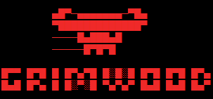
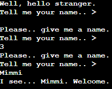
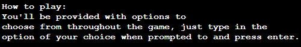
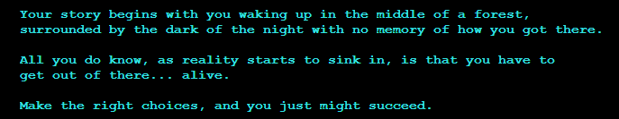
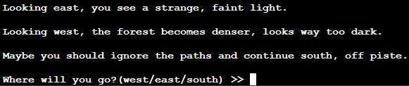
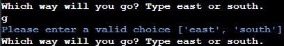
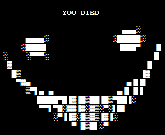
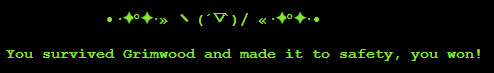
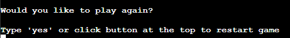
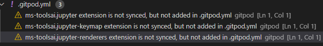

# Grimwood
Grimwood is a command line game in the genre of text-based adventure/survival.
It's the old but cliché story where the character wakes up in the middle of the woods with no memory of how they got there, and they're not alone.... 
The user will navigate through the story by typing an option of their choice in the command line when prompted to.
The goal of the game is to make the right choices and make it out of the woods alive.

- - - 

## Table of Contents

* [User Stories](#user-stories)
* [Design](#game--page-design)
* [Features](#features)
    * [Existing Features](#existing-features)
    * [Future Features](#future-features)
* [Testing](#testing)
    * [Validator Testing](#validator-testing)
    * [Manual Testing](#manual-testing)
    * [Bugs](#bugs)
    * [Unsolved Bugs](#unsolved-bugs)
* [Technologies Used](#technologies-used)
  * [Main Languages](#main-languages)
  * [Frameworks, Libraries & Programs](#frameworks-libraries--programs)
* [Deployment](#deployment)
* [Credits](#credits)
  * [Code](#code)

  
- - -
## User Stories

### As a user playing the game I want..
  * Clear instructions
  * The game content to be displayed nicely so that it's easy to read
  * For the game to be engaging and fun enough to play again
  * To experience different outcomes based on my choices

### As a site owner I want..
  * For input to be handled efficiently
  * To provide a fun and engaging gaming experience
  * For the game to be clear to users at all times

- - -
## Game & Page Design

### Flow chart mapping

This is the flow chart created with LucidChart, to act as a road map and show the the flow of the game.
## Interactions in the game
Most of the interactions in the game are options for the user to choose from, which direction they want to go or what they'll do in an encounter with the creature.
Options the user makes will provide different scenarios and outcomes.
There are two items the user can pick up in this game, a modern flashlight and an old flashlight. The user won't be able to access certain places without one or the other.
When the user reaches the abandoned house they will have an opportunity to investigate, and they will be able to investigate two places in order to find the second item that's needed to progress further.
## CSS
The only CSS that was added for this project was to center the terminal and button, as well as adding a dark grey background color.

- - -
## Features

### Existing Features

#### Start screen

The starting screen features an ascii art banner, and will ask the user to provide a name. The name will only be accepted if it only contains letters.

A short introduction message will then be displayed for the user, and let them know how to play the game.
The user will then be able to press enter to start the game.

The purpose of this is to introduce the user to the story and how to play the game.

#### Displaying text contents
Since this game is pretty heavy on the story part, I've done my best to make everything as clean and readable as possible using colorama library, whitespacing and new lines, checking the width. The longer parts of the story are all colored text, and have been placed in a separate file to keep the main game file cleaner.

The purpose of this is to not overwhelm the user and provide them with a structured and clean output, so that it's easy to keep up.

#### Player options
The options provided will be displayed for the user along with a prompt that will mostly ask for a direction or a choice between a-d.

An invalid input will display a message which ask for a valid input and the options that are valid.

#### Winning and losing
If the user wins or lose the game, a function will be called to display a message followed by some ascii art.

In both scenarios a prompt will also appear to ask the user if they want to play again, typing "yes" will restart the game, and any other key press will exit the game.

### Future Features
  * I would like to implement more types of user interactions to the game, maybe provide some puzzles for the user to solve.
  * More "rooms" and outcomes, to add more complexity to the game.

---

## Testing
Print statements were used throughout the project to identify errors or check if code were working correctly.
Alot of the testing were also done in visual studio code, where I experimented with code and tested ideas.

### Manual Testing
The game was played through and tested extensively to make sure everything was working as intented. Results:
  * Player menu shows instructions on 'i' key press and starts game on 'enter' key press✔️
  * Invalid input will show message to ask for correct input and prompt for it repeadeatly until a valid input is provided✔️
  * Options are correctly sliced from list throughout the game✔️
  * Global variables are working and affecting the game and story as intended✔️
  * Game over messages and win messages along with ascii art are displaying correctly✔️
  * Valid input of options are progressing through the game as intended✔️
  * For else loop where user can investigate two times is working correctly✔️
  * Story and other text content are working and displayed correctly✔️
  * Play again function works as intended and global variables are resetting in start_game function✔️

  ### User Testing Feedback
  * User thought that the game was displayed nicely on screen and that it was easy to follow.
  * User enjoyed the fact that there was different ways of winning, but even more ways of losing.
  * User enjoyed playing through multiple times, seeing the different different parts of the game.

### Validator Testing
### PEP8
There are no problems displayed with PEP8 in Gitpod, except the the three warnings which I was told was going to be there by default.

### Bugs

#### Line too long, pep8
  * **Fix** - Fixed by either shortening the text or changing them to multiline.

#### Incorrect options displayed
  * **Expected** - The options provided for the user would be taken from a global list by slicing it to get the desired options.
  * **Testing** - Used print statements to make sure that I spliced the correct options.
  * **Fix** - Fixed by changing the numbers of the slice.

#### Global variables does not reset
  * **Expected** - For global variables to reset to their default value when choosing to play again.
  * **Testing** - Tried importing the global variables from run.py to functions.py and resetting them in the play_again() function.
  * **Result** - Importing from run.py was not the way to go as it caused ImportError.
  * **Fix** - Added a new function to run.py, where I set the global variables to their default value, then made a call to the function in start_game()

### Unsolved bugs
No known unsolved bugs.
 
---

## Technologies Used

### Main Languages
  * Python

### Frameworks, Libraries & Programs
  * Python libraries used:
      * colorama
      * getch
  * [GitHub](https://github.com/) - To save and store files for the website.
  * Git - For version control.
  * Visual Studio Code(desktop) - for testing and experimenting with code
  * [LucidChart](https://lucid.app/) - for creating a flow chart to map out the game
  * Heroku
---

## Deployment

This project was deployed using heroku, steps to deployment are as follows:
  * Sign up to heroku if you haven't, then check for a button labelled "New" at the top right of the dashboard.
    * Click that button to display a dropdown menu and select "Create New App".
    * This will take you to a new page, where you can enter your region and choose a name for your new app, which must be unique. Then click "Create App"
  
  * On the next page, navigate to the "Settings" tab on the menu, and find the section called "Config Vars"
    * Click on the button labelled "Config Vars" and add necessary key and value
    * For this program, only one config var was needed: "PORT" as key and "8000" as value. Then click "Add".
    * Navigate to "Buildpacks" underneath "Config Vars".
    * Click "Add buildpacks", and add python and node.js.
    * Make sure the the buildpacks are in the right order, with python at the top and node.js at the bottom, this is important. Save your changes.

  * Scroll back to the top menu and click the "Deploy" tab.
    * Here you'll have some options for deployment, I used github for this.
    * Once you've clicked on the Github button you will be able to search for your Github repository and connect to it.
    * Once connected, it's time to deploy. You can choose to deploy automatically or manually.
    * For this deployment I chose automatic, which will update everytime you push.

  ### Forking and cloning
  If you'd want to experiment and work on this code you can fork or clone this project.
  This will allow you do whatever you want without altering the original.

  #### Steps to forking:
  * In the repository, navigate to the "Fork" button which is located in the top-right of the page, next to "Star".
  * Simply click on this button and a copy of this repository will be added to yours.

  #### Cloning:
  * Navigate to the top right of this repository and find the button labelled "Code", and click to display a dropdown menu.
  * Here you can either:
      * Choose the option "Download as ZIP" which will download all files and save a copy locally.
      * Choose the option "Open with Github Desktop" and work from there.

---

## Credits

### Code
  * [Stackoverflow](https://stackoverflow.com/) - Helped me out alot when looking for solutions to my code, and also found out how to create the typing function through this site.
  * [Escape the Cave](https://github.com/roomacarthur/escape-the-cave) - The idea of having certain functions in a separate file was taken from a fellow students text-based game, roomacarthur@Github!
  * [Codeigo](https://codeigo.com/python/check-if-user-pressed-enter) - I initially wanted to use the keyboard library for the little player menu to listen for key presses, but that library required root. This article provided me with a different solution using getch.
